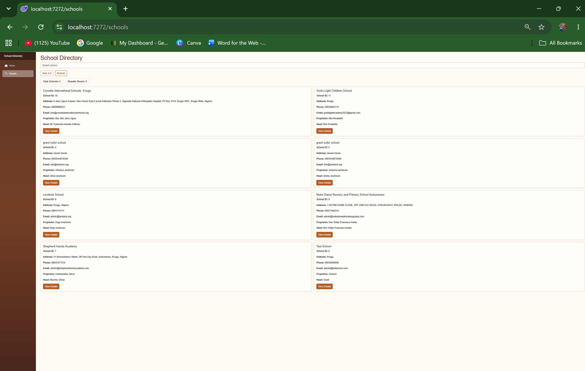
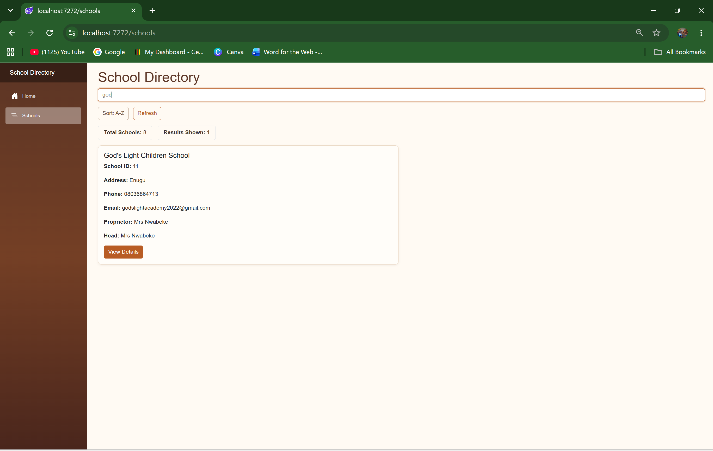
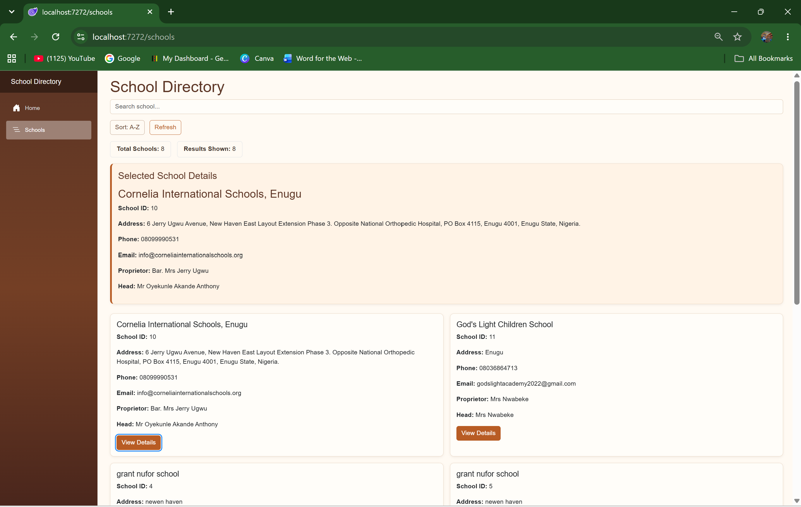
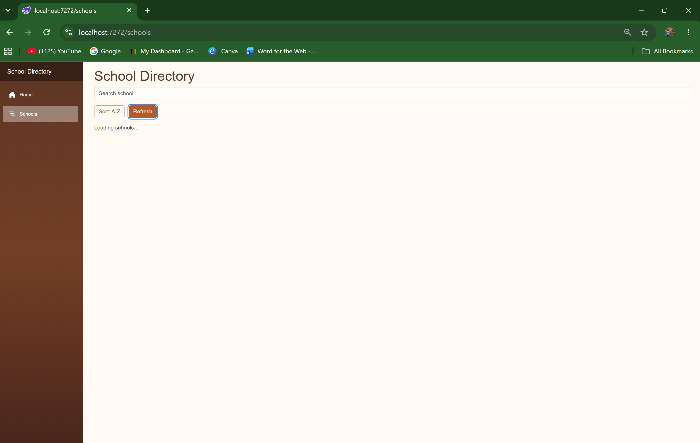
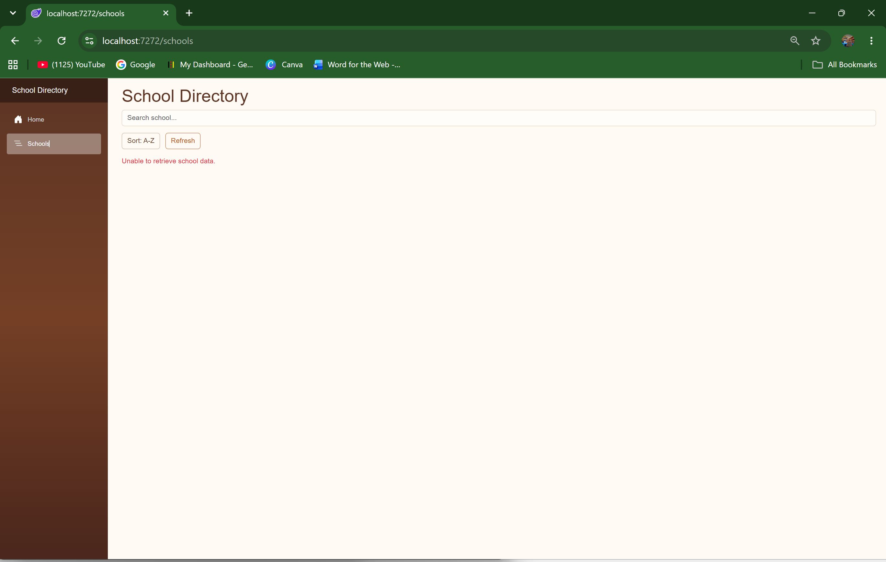

# School Directory Dashboard

A Blazor Web Application that consumes data from the Edutots School API and presents school information through a searchable, interactive and responsive user interface.

This project was developed for CA1 in BSC30926 Full-Stack Development.

## Features

- Retrieves school data from the Edutots School API
- Deserializes JSON data into C# models
- Displays school information using reusable Blazor components
- Real-time school search by name
- School details view using `EventCallback`
- Loading state while API data is being retrieved
- Error handling for failed API requests
- A-Z and Z-A sorting
- Refresh button to retrieve the latest API data
- School statistics showing total schools and filtered results
- Responsive Bootstrap layout
- Custom autumn-themed user interface

## Technologies Used

- C#
- .NET 10
- ASP.NET Core
- Blazor Web App
- Blazor Interactive Server
- Razor Components
- HttpClient
- LINQ
- Bootstrap
- HTML
- CSS
- Git
- GitHub

## API

The application uses the Edutots School API:

https://edutots.net/api/school

The API data is retrieved in `SchoolService.cs` using `HttpClient` and deserialized into a `List<School>`.

## Project Structure

```text
SchoolDirectoryApp
│
├── Models
│   └── School.cs
│
├── Services
│   └── SchoolService.cs
│
├── Components
│   ├── SchoolCard.razor
│   ├── SchoolDetails.razor
│   └── Pages
│       └── Schools.razor
│
├── Screenshots
│   ├── school-list.png
│   ├── search.png
│   ├── school-details.png
│   ├── loading.png
│   └── error.png
│
├── wwwroot
│   └── app.css
│
└── Program.cs

```

## How to Run the Application

### Requirements

- .NET 10 SDK
- Visual Studio 2026 or another compatible .NET development environment
- Internet connection to access the Edutots API

### Steps

1. Clone the repository: `git clone https://github.com/sebastian-lopez-cs/SchoolDirectoryApp.git`
2. Open the project in Visual Studio.
3. Open `SchoolDirectoryApp.slnx`.
4. Build the project.
5. Run the application.
6. Open the **Schools** page from the navigation menu or visit `/schools`.

The application retrieves school data from the Edutots API automatically.

## Screenshots

### School List Loaded

The application successfully retrieves and displays the available schools.



### Search Functionality

Schools can be filtered in real time by entering part of a school name.



### School Details

Selecting **View Details** displays the selected school's information.



### Loading State

A loading message is displayed while school data is being retrieved.



### Error Handling

If the API request fails, the application displays an error message instead of crashing.



## Additional Features

The application also includes:

- Responsive Bootstrap design
- A-Z and Z-A sorting
- Refresh functionality
- School statistics
- Custom autumn-themed interface

## Author

Sebastian Lopez